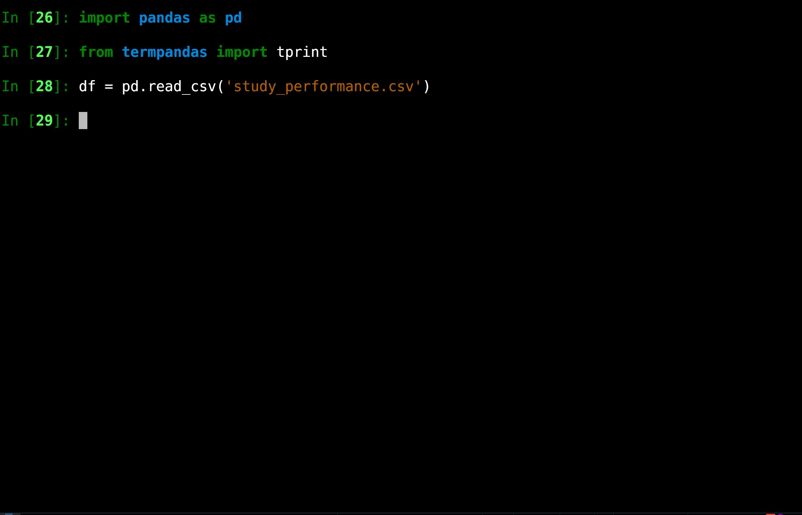

# termpandas
Scrollable Pandas DataFrames in the Terminal.

## Installation

```bash
pip install termpandas
```

## Usage

```python
import pandas as pd
from termpandas import tprint

df = pd.read_csv('titanic.csv')
tprint(df)
```



- Key Bindings:
    - k to scroll up
    - j to scroll down
    - h to scroll left
    - l to scroll right
    - q to quit

## Optional Parameters

- `num_rows`: Number of rows to display at a time. Default is 10.
```python
tprint(df, num_rows=5)
```
